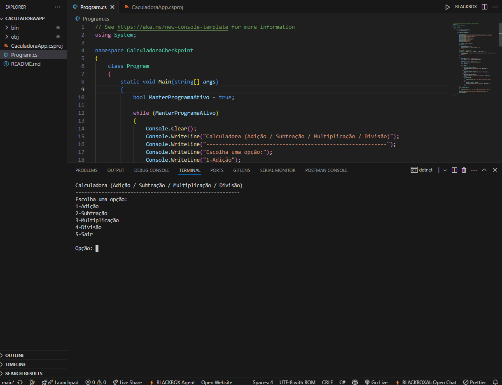
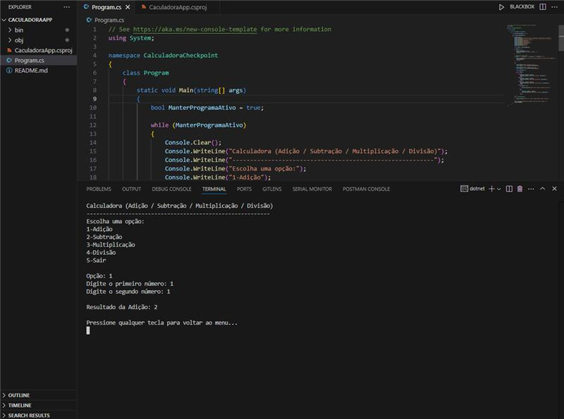
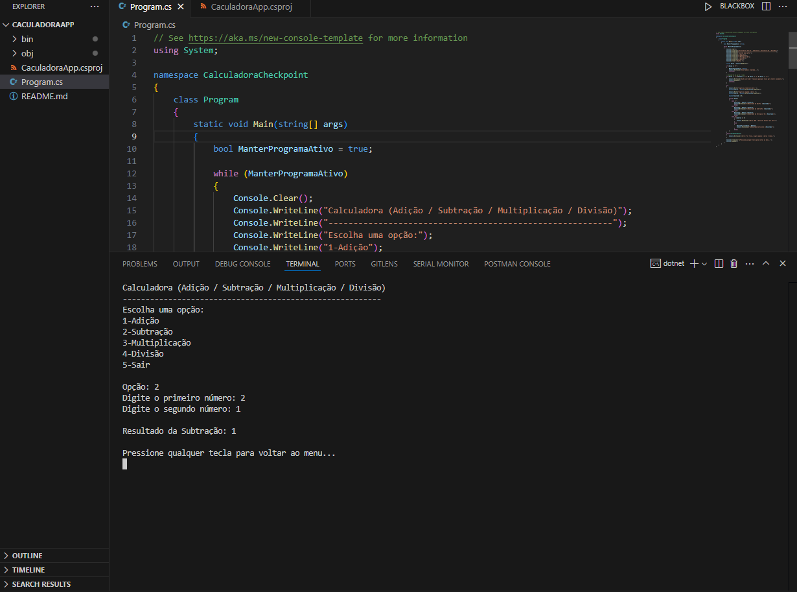
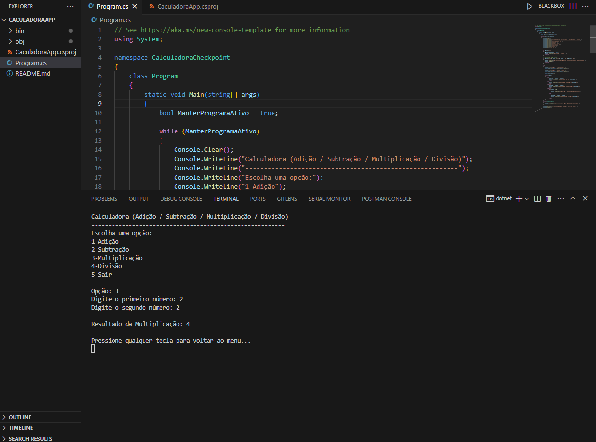
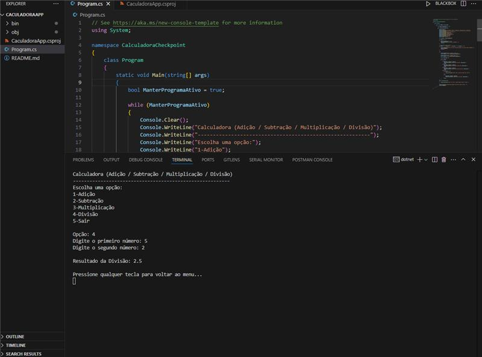
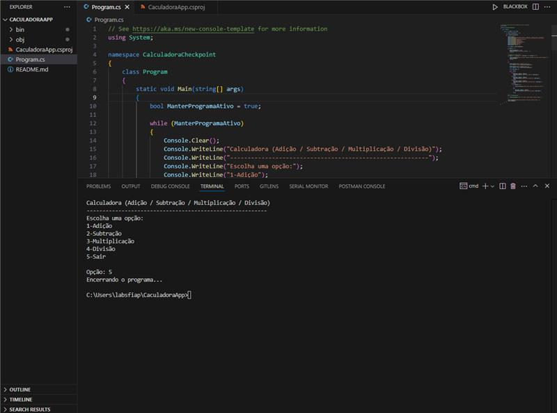

# Checkpoint1_C#-Software-Development
**Disciplina:** C#-Software-Development
**Professor:** Fábio Crusco da Silva
**Curso:** Engenharia de Software (FIAP)

# 🧮 Projeto Calculadora Console em C#

## 📝 Sobre o Projeto
Este projeto foi desenvolvido como parte do **Checkpoint 1** da disciplina de Software Development. Trata-se de uma aplicação de console interativa que realiza operações matemáticas básicas, aplicando conceitos fundamentais da linguagem C#.

O objetivo principal é demonstrar o uso prático de estruturas de repetição, condicionais e tratamento de exceções para criar uma ferramenta funcional e amigável ao usuário.

## 🛠️ Funcionalidades
* **Adição (+):** Soma de dois valores decimais.
* **Subtração (-):** Diferença entre dois valores.
* **Multiplicação (*):** Produto de dois valores.
* **Divisão (/):** Quociente de dois valores (com proteção contra divisão por zero).
* **Fluxo Contínuo:** O programa permanece em execução até que o usuário escolha explicitamente sair (opção 5).

## 💻 Conceitos Técnicos Aplicados
* **Estruturas de Controle:** Uso de `while` para manter o programa ativo e `switch/case` para o menu de operações.
* **Tipagem de Dados:** Utilização do tipo `double` para permitir cálculos com números decimais.
* **Tratamento de Erros:** Implementação de blocos `try-catch` para lidar com entradas de texto inválidas e verificação `if` para evitar erros lógicos em divisões por zero.
* **Boas Práticas:** Código organizado seguindo a convenção **PascalCase** para nomeação de variáveis e métodos.

## 👥 Integrantes
* Nickolas Moreno Cardoso – RM557132
* André Giovanne de Maria – RM556384

## Prints

